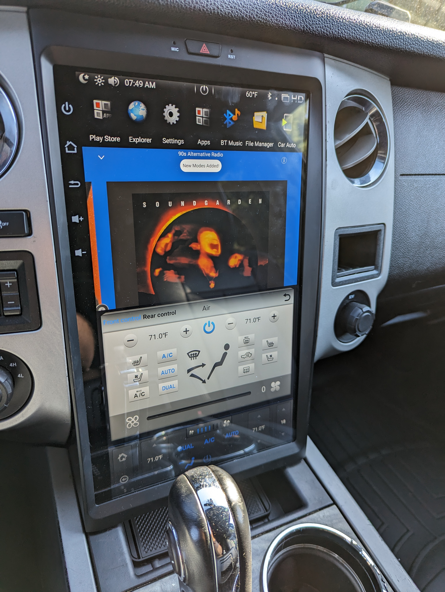

# Infotainment

I was originally planning on trying to make an F150 unit work, assuming the fit might not be perfect and CAN functions might be messed up, but then I came across this KSPIV unit designed specifically for the 3rd-gen Expedition.  Overall I'm very happy with it, but it does have a few quirks I'm working through w/ KSPIV.  On that note, I have to commend KSPIV on their very personable support.  These Android units can be fairly complex and they're very responsive and open about how the unit works.

Who needs model numbers when you can have awesome SEO-driven product names like [KSPIV 4G+64G Android 9 Car Stereo 17 Inch Tesla Style Touchscreen for Ford Expedition 2007-2017 High Version Car Radio Bluetooth with Apple Carplay & Android Auto,GPS Navigation Unit,Backup Camera](https://amzn.to/3pxkje4)?

## Installation Notes

* Keep the clips from your old head and trim as you'll need them to snap the new unit it.  You can set it in place to test without the clips, but it'll fall out on heavy acceleration.
* You need to ground the reverse wire with the bullet end to the head chassis in order for it to properly detect when you're in reverse.

## Features

| Feature | Notes | Issue |
| - | - | - |
| Screen | Works OOTB -- vibrant and crisp |
| Split Screen | Works OOTB, but not all apps support it |
| Factory Rear View Camera | Plug-and-play.  Cam View app works OOTB for rear, front, and side inputs.  Screen goes black when vehicle is in reverse so long as the reverse wire with the bullet end is grounded, but the reverse cam doesn't show up.  After putting the vehicle back in drive, you have to select the Radio app again to turn the amp back on. | https://github.com/cilynx/expedition/issues/1 |
| Touch | Works OOTB including multi-touch gestures like pinch/zoom/drag, even with gloves on |
| Autodimming | Works OK OOTB, but doesn't dim enough for night driving even with Waze in dark mode.  Twilight installed from the Play Store does the job, but this should be built in. | https://github.com/cilynx/expedition/issues/5, [Sergey's workaround](https://www.facebook.com/groups/tesla.style.FW.HU/posts/2174834042824357/) |
| Virtual Assistant | Barely works -- you don't actually need it and I'd rather disable the overlay, but haven't figured out how to yet. |
| Android Auto | Works over USB and Bluetooth, but I'll never use it as native apps are nicer. |
| Cabin Ambient Lighting | Has an app that matches the colors of the factory color switcher, but it doesn't work. | https://github.com/cilynx/expedition/issues/13 |
| Wireless Phone Charging | Plug [this charging mat](https://amzn.to/3ret2SZ) into one of the USB ports on the back of the head and route the cable under the unit then you can just throw your phone in the well to charge. |
| Wifi | Works OOTB.  Reception is a bit weak.  Works great with a hotspot in the truck, but can barely see my home wifi from the driveway even though my phone picks it up very well.  Antenna can be replaced, but I haven't found a better one yet. |
| Mobile connectivity | The head does not have a SIM slot, so there is no option for native 4G/5G.  Wifi works great OOTB with my phone's Wifi hotspot.  USB connectivity works great OOTB with a [Netgear M1](https://amzn.to/44uldqt). | https://github.com/cilynx/expedition/issues/14 |
| Front A/C Controls | Work great OOTB |
| Rear A/C Controls | Rear Lock appears to be reversed -- rear controls work when Rear Lock is enabled on the head and the head overrides the rear controls when Rear Lock is disabled on the head. | https://github.com/cilynx/expedition/issues/7 |
| Front Heated / Cooled Seats | Not currently working -- on-screen buttons don't respond to taps. | https://github.com/cilynx/expedition/issues/8 |
| Steering Wheel Controls | Volume Up/Down/Mute and Prev/Next work OOTB.  Other functions untested. |
| Door Open Display | Works OOTB so long as CAN2 is not connected |
| Speedometer / Tachometer | Neither works.  Connecting CAN2 either behind the dash or on the OBD2 port causes the Door Open Display to freak out and speedo and tach on the head still don't work.  The real speedo and tach on the cluster work fine. |
| AM/FM Radio | Works OOTB |
| Pandora | Installs from Play Store and mostly works OOTB.  When first booting, you have to open up Radio then switch back to Pandora to get audio output. | https://github.com/cilynx/expedition/issues/3 |
| Equalizer | Works great OOTB |
| Balance / Fade | Balance (L/R) works OOTB.  Fade (F/B) does not work due to how the truck is wired from the factory.  Until I get I-CAN working, you need to set the fade where you want it with the factory head and the amp/DSP will remember it when you swap back to the KSPIV. | https://github.com/cilynx/expedition/issues/2 |
| Onboard Amplifier | You have to open the Radio app and select a station to turn on the head's amp before any other app can make sound. | https://github.com/cilynx/expedition/issues/3 |
| Factory Amplifier / DSP | KSPIV is not connected to I-CAN at all, so you need to set up your factory amp using the factory head before you swap in the KSPIV.  I set mine to 90% volume and flat EQ, balance, and fade. | https://github.com/cilynx/expedition/issues/4 |
| Factory Speakers | Plug and play with the Sony system in my truck.  Remember, the rear speaker connections from the head don't actually go anywhere, they just terminate in the harness under the dash.  The signal is carried to the factory amp/DSP using the front speaker connections only. | https://github.com/cilynx/expedition/issues/4 |
| Waze | Installs from Play Store and works OOTB |
| GPS | Works with the antenna that comes with the headunit shoved up under the dash.  Can take a minute to get lock if you don't power it up every day.  Not working with the stock Expedition antenna at this time. Can take quite a while to get lock the very first time -- try sticking the antenna on the roof to get the initial lock before hiding it in the dash. | https://github.com/cilynx/expedition/issues/9 |
| YouTube | Pre-installed and working OOTB |
| Netflix | Not available in the Play Store for Android 9.  If you write to KSPIV support, they'll send you an APK that works along with instructions on how to side-load it. |
| Play Store | Crashed a lot at first.  After finding a work-around to updating Play Store itself, it now works as it should.  Some apps are not available as the head is running Android 9 which is pretty outdated.  KSPIV is working on an Android 11 version that should improve the situation. |

## User Settings

| Setting | Description | Working | Notes |
|-|-|-|-|
|Autorun navi|Run preferred navigation app automatically on startup|Yes||
|Auto Split screen in navi|Automatically size your navigation app to half the screen and bring up the Console in the other half of the screen|Yes|Waze looks better with more screen real estate, so I keep this OFF|
|Navi volume|Navigation of the volume app|Untested||
|Track line|Trajectory lines on backup camera display|The lines show up when forcing the reverse display, but even though the lines are curved, they don't move with the steering wheel.| https://github.com/cilynx/expedition/issues/15 |
|Parking sound||Untested||
|Sound attenuation when reversing|Turn down the volume when the vehicle is in reverse|Regardless of how this is set, the unit cuts both the display and the amplifier when the vehicle is in reverse.| https://github.com/cilynx/expedition/issues/1, https://github.com/cilynx/expedition/issues/3 |
|Touch Tone|Beep every time you touch the screen|Yes|The tone isn't nearly as annoying as other Android heads I've played with.  I actually keep it enabled on this one.|
|ACC volume||Untested|
|Display speed|What to show in the console.  Meter: Speedometer and Tachomoter; Compass: Compass, Lat/Long, and Altitude from GPS; Gyroscope: Pitch, Role, and GPS info|GPS stuff works.  Speedo, tach, pitch, and role do not.|Is this supposed to come over the broken CAN2 connection?|
|Speed unit|MPH vs KM/H for the console speedometer|Yes||
|Temp unit|°F vs °C - unit for the A/C and header bar temperature display|Yes||
|Sleep time|I think this is how long the unit will sleep after turned off before it powers down|Untested|When sleeping, the unit comes back up very quickly and to your prior state.  When powered down, bootup takes longer and goes to your default configured state.|
|Reset when break down|Not sure about this one -- guessing maybe it resets to some sort of failsafe configuration when the unit crashes|Untested||
|Brake detect|Lock out video playback unless the parking brake is on|Untested||
|Output image to external display||Untested||
|Car Auto-Apple device USB setting|Charge Only or Apple CarPlay|Untested|I don't use or want to use Apple CarPlay, so I keep this disabled.|
|Car Auto-Android device USB setting|Charge Only or Android Auto|Yes|I don't use or want Android Auto, so I keep this disabled.|
